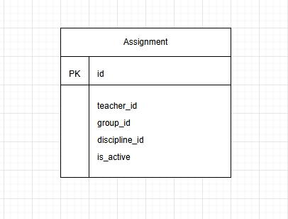

# Вариант S15: Load Assignment Service (Сервис распределения нагрузки)

## Архитектурная концепция
Сервис хранит только связи между преподавателями, группами и дисциплинами.  
Справочные данные (преподаватели, группы, дисциплины) управляются в других сервисах.

**Принципы:**
- В БД сервиса есть только таблица `Assignment`.
- Поля `teacher_id`, `group_id`, `discipline_id` — обычные целочисленные поля (не внешние ключи).
- Поле `hours` хранит количество часов нагрузки для конкретного назначения.
- Сервис не проверяет существование ID в источниках — это ответственность клиента.
- Удаление связей — логическое через `is_active`.

---

## Сущность Assignment

### Добавить Assignment

| Параметр | Пояснение | Обязательность | Тип | Ограничение |
|----------|-----------|----------------|-----|-------------|
| `teacher_id` | ID преподавателя (из Teacher Service) | Да | int | > 0 |
| `group_id` | ID группы (из Group Service) | Да | int | > 0 |
| `discipline_id` | ID дисциплины (из Discipline Service) | Да | int | > 0 |
| `hours` | Количество часов нагрузки | Да | int | > 0 |

**Уникальные комбинации параметров:**  
- `teacher_id + group_id + discipline_id`

**Информация, возвращаемая в случае удачного создания:**

| Параметр | Тип |
|----------|-----|
| `id` | int |
| `teacher_id` | int |
| `group_id` | int |
| `discipline_id` | int |
| `hours` | int |
| `is_active` | bool |

---

### Изменить Assignment по ID

| Параметр | Пояснение | Обязательность | Тип | Ограничение |
|----------|-----------|----------------|-----|-------------|
| `teacher_id` | ID преподавателя | Нет | int | > 0 |
| `group_id` | ID группы | Нет | int | > 0 |
| `discipline_id` | ID дисциплины | Нет | int | > 0 |
| `hours` | Количество часов нагрузки | Нет | int | > 0 |

**Информация, возвращаемая в случае удачного изменения:**

| Параметр | Тип |
|----------|-----|
| `id` | int |
| `teacher_id` | int |
| `group_id` | int |
| `discipline_id` | int |
| `hours` | int |
| `is_active` | bool |

---

### Удалить Assignment по ID
Логическое удаление — устанавливает `is_active = False`.

**Возвращает:** `True`, если запись найдена и деактивирована, иначе `False`.

---

### Получить Assignment по ID

| Параметр | Пояснение | Тип |
|----------|-----------|-----|
| `id` | Идентификатор назначения | int |
| `teacher_id` | ID преподавателя | int |
| `group_id` | ID группы | int |
| `discipline_id` | ID дисциплины | int |
| `hours` | Количество часов нагрузки | int |
| `is_active` | Признак активности | bool |

**Возвращает:** объект Assignment или `None`.

---

### Получить список Assignment по заданным параметрам

| Параметр | Пояснение | Тип |
|----------|-----------|-----|
| `teacher_id` | Фильтр по преподавателю | int |
| `group_id` | Фильтр по группе | int |
| `discipline_id` | Фильтр по дисциплине | int |
| `hours` | Фильтр по количеству часов нагрузки | int |
| `is_active` | Фильтр по активности | bool |

**Информация возвращается в виде списка:**

| Параметр | Тип |
|----------|-----|
| `id` | int |
| `teacher_id` | int |
| `group_id` | int |
| `discipline_id` | int |
| `hours` | int |
| `is_active` | bool |

---

## ER-диаграмма

```text
+----------------------+
|      Assignment      |
+----------------------+
| PK id                |
| teacher_id           |
| group_id             |
| discipline_id        |
| hours                |
| is_active            |
+----------------------+
```


